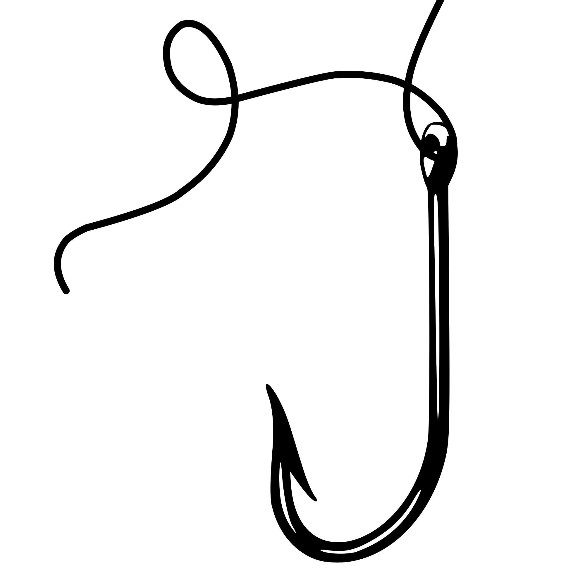

<div align="center">

  <picture>
    <source media="(prefers-color-scheme: dark)" srcset="assets/logo-white.png">
    <source media="(prefers-color-scheme: light)" srcset="assets/logo-black.png">
    
  </picture>

# Floya's Phish Hunter

A python script to filter latest URLs from [PhishStats](https://phishstats.info/), [OpenPhish](https://openphish.com/), [PhishHunt](https://phishunt.io/)

Created for my internship at [Gendigital](https://gendigital.com/)/[Avast](https://www.avast.com/)
</div>

## Usage

To show both hits and no hits:

```bash
$ python3 all.py
Keyword (leave blank to initiate scan):
```

### Options:

Look for specific keywords

```
$ python3 all.py
Keyword (leave blank to initiate scan): login
Added: login
Keyword (leave blank to initiate scan):
```

`-oh` = Only hits

```
$ python3 all.py -oh
```

## Features

* Fetch URLs from PhishStats, OpenPhish, PhishHunt
* Filter URLs based on keywords
* 2 minute delay between scans
* Default keywords (./keywords.txt)

## To-do

- [ ] Add feature to fetch older posts
- [x] Add an option to not show no hits (only hits)
- [ ] Daily report of top targeted brands or keywords
- [x] Add an option to only fetch selected APIs